  

 

<!-- TYPING ANIMATION -->

 

<!-- CONTACT BADGES -->

&nbsp;

&nbsp;

&nbsp;
<!-- PRO BADGE AÑADIDA -->

  

---

## 〔 01 〕Sobre mí

Soy **Herlan Mistas (@MiStAs27)** , estudiante de Ingeniería de Sistemas en Bolivia. Mi enfoque principal es la creación de soluciones clínicas y aplicaciones multiplataforma. Actualmente, estoy expandiendo mis conocimientos en Flutter y React Native, con el objetivo de transformar problemas reales en software funcional y de calidad.

---

## 〔 02 〕Stack tecnológico

### Lenguajes

### Frontend & Mobile

### Backend & Datos

### Herramientas

---

## 〔 03 〕Proyectos destacados

| 🔷 Proyecto | 📋 Descripción | 🛠️ Stack | 🔗 |
|:------------|:---------------|:---------|:--:|
| **Dentista2** | Sistema completo de gestión para consultorios dentales | TypeScript | [→](https://github.com/MiStAs27/Dentista2) |
| **DentSync Mobile** | App móvil de sincronización clínica en tiempo real | C++ | [→](https://github.com/MiStAs27/dentsync_mobil) |
| **V_CK** *(privado)* | Herramienta interna de automatización empresarial | TypeScript | 🔒 |

---

## 〔 04 〕Estadísticas

&nbsp;

  

---

## 〔 05 〕Contacto

¿Tienes un proyecto, idea o propuesta? Estoy abierto a colaborar en soluciones con impacto real.

 

&nbsp;

  

---

  Hecho con 💙 desde Bolivia · <a href="https://github.com/MiStAs27">@MiStAs27</a> · 2026

